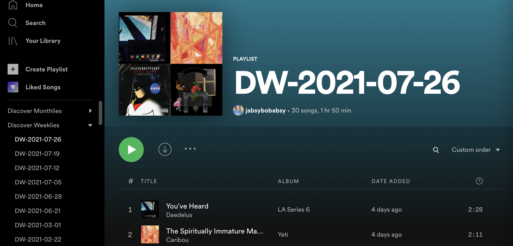
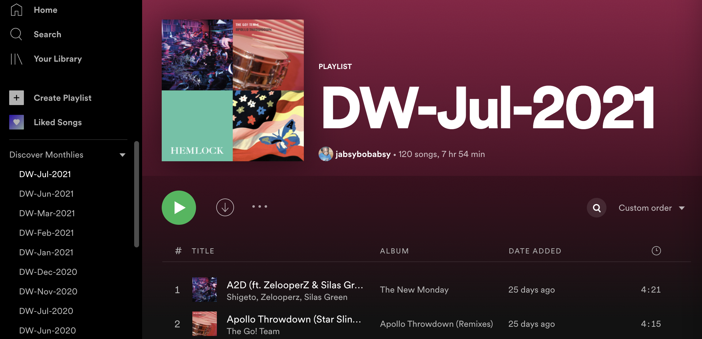

# Discosavor

**Problem:** My wife and I love finding new music with Spotify's rotating [Discover Weekly](https://www.spotify.com/us/discoverweekly/) playlist. Sadly, each week the songs on your Discover Weekly disappear without a trace. There isn't any way to retrieve songs from past Discover Weekly playlists.

**Solution:** I created `Discosavor` as a way to preserve all of our Discover Weekly playlists so we can ~~enjoy~~ savor them whenever we want.

`Discosavor` automatically does two things:
1. Saves the current Discover Weekly into its own standalone playlist titled based on Monday's date (e.g. `DW-2021-07-26`)
2. Collects the entire month's Discover Weekly tracks in a standalone playlist (e.g. `DW-Jul-2021`).




Demo of the web app UI here: https://hyzypg.pythonanywhere.com/

(**Note**: The playlist folders in the above screenshots are user created – the Spotify API does not have endpoints for interacting with playlist folders.)

## Installation
**Note**: Runs on Python 3.6.0 in production.

```
$ git clone https://gitlab.com/jallen92/flask-spotify.git
$ cd flask-spotify
```

#### macOS

We can use `pyenv` to ensure we're using python 3.6.0.
```
$ brew install pyenv
$ pyenv install 3.6.0
$ pyenv local 3.6.0
$ pyenv exec python3 -V
$ pyenv exec python3 -m venv venv
$ source venv/bin/activate
$ pip install -r requirements.txt
```

#### Windows
```
$ python3 -m venv venv
$ source venv/Scripts/activate
$ pip install -r requirements.txt
```

You can do a quick test run of running `jobs.py` from the terminal with the below commands. It will either grab (and print to terminal) the current week's *saved* Discover Weekly or create it if it doesn't exist (hardcoded to only run for my Spotify user).

```
$ export MY_WEEKLY_NOW=True
$ python jobs.py
```

You can set up a scheduled task to run `jobs.py` from your local macOS machine using the `full_run_job_now` file (or test with `run_my_weekly_now`) and following the instructions [here](https://medium.com/analytics-vidhya/effortlessly-automate-your-python-scripts-cd295697dff6). Both require a top user level folder named `scheduled_tasks`.

**Note**: make sure you're using python 3.6 for any/all commands. Should be automatic with the above `pyenv` and `venv` commands. But can verify with `python -V`. And can force usage of the local python version with `pyenv exec python3`.

To run web app locally:
```
$ export FLASK_APP=spotify_dw.py
$ export FLASK_CONFIG=dev
$ flask run
```

## Development

Ensure you have the latest changes:
```
$ git pull origin master
```

To run the Flask console/shell use the below commands. You can access the main functions with the `Tools` variable (see `spotify_dw.py`).
```
$ export FLASK_APP=spotify_dw.py
$ flask shell
```

If you need to update database models from the newest migration:
```
$ flask db upgrade
```

To get a specific remote branch for local development:
```
$ git pull origin <rbranch>:<lbranch>
$ git checkout <lbranch>
```

### Merging

To merge a branch with master:
```
$ git checkout <branch>
$ git merge master #to keep master clean while resolving any conflicts
$ git checkout master
$ git merge <branch> #should be a clean merge
```

Tag branches after merging and before deleting:
```
$ git checkout <branch>
$ git tag -a <version> -m "<version description>"
$ git push origin <version> #push the tag to the remote repo
```

Finally, delete the branch:
```
$ git checkout master
$ git branch -d <branch>
$ git push origin :<branch> #delete the branch from the remote repo
```
